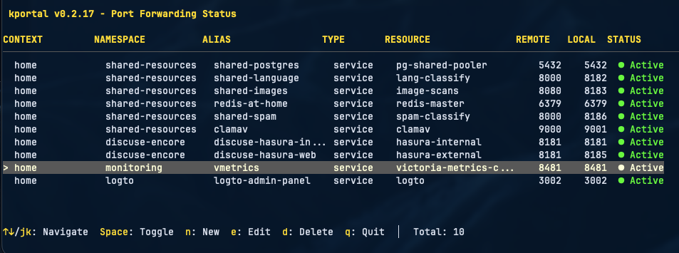

<p align="center">
  
</p>

<p align="center">
  <a href="https://github.com/lukaszraczylo/kportal/releases"></a>
  <a href="LICENSE"></a>
  <a href="https://goreportcard.com/report/github.com/lukaszraczylo/kportal"></a>
</p>

<p align="center">
  <strong>Modern Kubernetes port-forward manager with interactive terminal UI</strong>
</p>

kportal simplifies managing multiple Kubernetes port-forwards with an elegant, interactive terminal interface. Built with [Bubble Tea](https://github.com/charmbracelet/bubbletea), it provides real-time status updates, automatic reconnection, and hot-reload configuration support.



## ✨ Features

- 🎯 **Interactive TUI** - Beautiful terminal interface with keyboard navigation (↑↓/jk, Space to toggle, q to quit)
- ➕ **Live Add** - Add new port-forwards on-the-fly without editing config files or restarting
- ✏️ **Live Edit** - Modify existing port-forwards (ports, resources, aliases) in real-time
- 🗑️ **Live Delete** - Remove port-forwards instantly from the running session
- 🔄 **Auto-Reconnect** - Automatic retry with exponential backoff on connection failures (max 10s)
- ⚡ **Hot-Reload** - Update configuration without restarting - changes applied automatically
- 🏥 **Health Checks** - Real-time port forward status monitoring with 5-second intervals
- 🎨 **Multi-Context** - Support for multiple Kubernetes contexts and namespaces
- 📦 **Batch Management** - Manage all port-forwards from a single configuration file
- 🔌 **Toggle Forwards** - Enable/disable individual port-forwards on the fly with Space key
- 🚀 **Grace Period** - Smart 10-second grace period to avoid false "Error" status on startup
- 📊 **Status Display** - Clear visual indicators: Active (●), Starting (○), Reconnecting (◐), Error (✗)
- 🔍 **Error Reporting** - Detailed error messages displayed below the table
- 🔄 **Pod Restart Handling** - Detects and reconnects to pods when they restart
- 🏷️ **Label Selector Support** - Dynamically target pods using label selectors
- 📋 **Prefix Matching** - Automatically find and reconnect to pods with name prefixes
- 🚫 **Port Conflict Detection** - Validates port availability before starting with detailed PID info
- 🎭 **Alias Support** - Cleaner, more readable display names for your forwards

## 📦 Installation

### Homebrew (macOS/Linux)

```bash
brew install lukaszraczylo/brew-taps/kportal
```

### Quick Install Script

```bash
curl -fsSL https://raw.githubusercontent.com/lukaszraczylo/kportal/main/install.sh | bash
```

### Manual Download

Download the latest binary for your platform from the [releases page](https://github.com/lukaszraczylo/kportal/releases):

- **macOS**: `kportal-{version}-darwin-{amd64|arm64}.tar.gz`
- **Linux**: `kportal-{version}-linux-{amd64|arm64}.tar.gz`
- **Windows**: `kportal-{version}-windows-{amd64|arm64}.zip`

### Build from Source

```bash
git clone https://github.com/lukaszraczylo/kportal.git
cd kportal
make build
make install
```

## 🚀 Quick Start

1. **Create a configuration file** (`.kportal.yaml`):

```yaml
contexts:
  - name: production
    namespaces:
      - name: backend
        forwards:
          - resource: service/postgres
            protocol: tcp
            port: 5432
            localPort: 5432
            alias: prod-db

      - name: frontend
        forwards:
          - resource: service/redis
            protocol: tcp
            port: 6379
            localPort: 6380
            alias: prod-redis
```

2. **Run kportal**:

```bash
kportal
```

3. **Navigate the interface**:
   - `↑↓` or `j/k` - Navigate through forwards
   - `Space` or `Enter` - Toggle forward on/off
   - `a` - Add new port-forward interactively
   - `e` - Edit selected port-forward
   - `d` - Delete selected port-forward
   - `q` - Quit application

## 📖 Configuration

### Simple Configuration

```yaml
contexts:
  - name: <context-name>
    namespaces:
      - name: <namespace-name>
        forwards:
          - resource: <resource-type>/<resource-name>
            protocol: tcp
            port: <remote-port>
            localPort: <local-port>
            alias: <friendly-name>  # Optional
```

### Advanced Configuration

```yaml
contexts:
  # Production cluster
  - name: prod-us-west
    namespaces:
      - name: databases
        forwards:
          # Direct pod connection with prefix matching
          - resource: pod/postgres-primary
            protocol: tcp
            port: 5432
            localPort: 5432
            alias: prod-postgres

          # Service connection
          - resource: service/redis-master
            protocol: tcp
            port: 6379
            localPort: 6379
            alias: prod-redis

          # Pod with label selector
          - resource: pod
            selector: app=mongodb
            protocol: tcp
            port: 27017
            localPort: 27017
            alias: mongo

      - name: applications
        forwards:
          - resource: deployment/api-server
            protocol: tcp
            port: 8080
            localPort: 8080
            alias: api

  # Development cluster
  - name: dev-local
    namespaces:
      - name: default
        forwards:
          - resource: service/grafana
            protocol: tcp
            port: 3000
            localPort: 3000
            alias: grafana-dashboard
```

### Configuration Options

| Field | Type | Required | Description |
|-------|------|----------|-------------|
| `resource` | string | Yes | Kubernetes resource with type prefix (e.g., `service/name`, `pod/name`) |
| `protocol` | string | Yes | Connection protocol (typically `tcp`) |
| `port` | int | Yes | Remote port on the Kubernetes resource |
| `localPort` | int | Yes | Local port to forward to |
| `alias` | string | No | Friendly name for display (defaults to resource name) |
| `selector` | string | No | Label selector for dynamic pod selection (e.g., `app=nginx,env=prod`) |

### Resource Formats

- **Pod by name**: `pod/pod-name` or just `pod-name`
- **Pod by prefix**: `pod/my-app` (matches `my-app-xyz789`, `my-app-abc123`, etc.)
- **Pod by selector**: Set `resource: pod` and use `selector: app=nginx`
- **Service**: `service/service-name` or `svc/service-name`
- **Deployment**: `deployment/deployment-name` or `deploy/deployment-name`

## 🎮 Usage

### Interactive Mode (Default)

```bash
kportal
```

Starts the interactive TUI where you can:
- View all configured port-forwards in a table
- See real-time status updates (Active, Starting, Reconnecting, Error)
- Toggle forwards on/off with Space key
- View detailed error messages at the bottom of the screen

### Verbose Mode

```bash
kportal -v
```

Runs in verbose mode with:
- Detailed logging to stdout
- Periodic status table updates every 2 seconds
- Full error traces
- No interactive controls (for automation/debugging)

### Validate Configuration

```bash
kportal --check
```

Validates your configuration file without starting any forwards:
- Checks YAML syntax
- Validates all required fields
- Detects duplicate local ports
- Shows validation errors with line numbers

### Custom Configuration File

```bash
kportal -c /path/to/config.yaml
```

### Version Information

```bash
kportal --version
# Output: kportal version 0.1.5
```

## 🔄 kftray Migration

Migrate from kftray JSON configuration:

```bash
kportal --convert configs.json --convert-output .kportal.yaml
```

**Example conversion:**

kftray JSON:
```json
[
  {
    "service": "postgres",
    "namespace": "default",
    "local_port": 5432,
    "remote_port": 5432,
    "context": "production",
    "workload_type": "service",
    "protocol": "tcp",
    "alias": "prod-db"
  }
]
```

Converts to kportal YAML:
```yaml
contexts:
  - name: production
    namespaces:
      - name: default
        forwards:
          - resource: service/postgres
            protocol: tcp
            port: 5432
            localPort: 5432
            alias: prod-db
```

## 🎨 Status Indicators

| Indicator | Status | Description |
|-----------|--------|-------------|
| `● Active` | 🟢 Green | Port-forward is active and healthy |
| `○ Starting` | 🟡 Yellow | Initial connection in progress (10s grace period) |
| `◐ Reconnecting` | 🟡 Yellow | Attempting to reconnect after failure |
| `✗ Error` | 🔴 Red | Connection failed - see error details below table |
| `○ Disabled` | ⚪ Gray | Port-forward manually disabled via Space key |

## 🛠️ Advanced Features

### Hot-Reload

kportal automatically watches for configuration file changes and reloads:

```bash
# Edit your config while kportal is running
vim .kportal.yaml

# Changes are applied automatically within seconds:
# - New forwards are started
# - Removed forwards are stopped
# - Existing forwards continue running unchanged
```

Supports manual reload via `SIGHUP`:
```bash
kill -HUP $(pgrep kportal)
```

### Health Checks

Built-in health monitoring system:
- **Check interval**: Every 5 seconds
- **Timeout**: 2 seconds per check
- **Grace period**: 10 seconds for new connections
- **Automatic updates**: Real-time status changes in UI
- **Error tracking**: Detailed error messages for failed connections

### Error Display

When connections fail, errors are displayed below the table:

```
Errors:
  • prod-postgres: dial tcp 127.0.0.1:5432: connect: connection refused
  • prod-redis: i/o timeout after 2.0s
```

Errors automatically clear when:
- Connection becomes healthy
- Forward is disabled
- Forward is removed

### Port Conflict Detection

kportal checks for port conflicts at multiple stages:

**At startup:**
```
Port conflicts detected:
  Port 8080:
    • Requested by: api-server (context: prod, namespace: default)
    • Currently used by: PID 1234 (chrome)
```

**During hot-reload:**
- Only validates new ports being added
- Skips currently managed ports
- Rejects configuration if conflicts found

### Pod Restart Handling

When a pod restarts:
1. Port-forward connection breaks
2. kportal immediately re-resolves the resource:
   - For prefix matches: Finds newest pod with matching prefix
   - For selectors: Re-queries pods with matching labels
3. Reconnects to new pod
4. Logs the switch: `Switched to new pod: old-pod-abc → new-pod-xyz`

### Retry Strategy

Exponential backoff with maximum interval:
- **Intervals**: 1s → 2s → 4s → 8s → 10s (max)
- **Infinite retries**: Continues until connection succeeds
- **Independent**: Each forward has its own retry logic
- **Grace period**: First 10 seconds show "Starting" instead of "Error"

## 🔧 Development

### Prerequisites

- Go 1.23 or higher
- Access to a Kubernetes cluster
- kubectl configured with contexts

### Building

```bash
# Build binary
make build

# Run tests
make test

# Run all checks (fmt, vet, staticcheck, test)
make all

# Check current version
make version

# Install locally
make install

# Install system-wide
sudo make install-system

# Clean build artifacts
make clean
```

### Project Structure

```
kportal/
├── cmd/kportal/              # Main application entry point
├── internal/
│   ├── config/               # Configuration parsing and validation
│   ├── forward/              # Port-forward manager and workers
│   │   ├── manager.go        # Orchestrates all forwards
│   │   ├── worker.go         # Individual forward worker
│   │   └── port_checker.go   # Port conflict detection
│   ├── healthcheck/          # Health monitoring system
│   │   └── checker.go        # Port health checking
│   ├── k8s/                  # Kubernetes client wrapper
│   │   ├── client.go         # K8s client management
│   │   ├── port_forward.go   # Port-forward implementation
│   │   └── resolver.go       # Resource resolution
│   ├── retry/                # Retry logic with backoff
│   │   └── backoff.go        # Exponential backoff
│   ├── ui/                   # Terminal UI implementations
│   │   ├── bubbletea_ui.go   # Interactive TUI (Bubble Tea)
│   │   └── table_ui.go       # Simple table for verbose mode
│   └── converter/            # kftray JSON converter
├── Formula/                  # Homebrew formula
├── .github/workflows/        # CI/CD pipelines
│   └── release.yml           # Release automation
├── install.sh                # Installation script
├── semver.yaml               # Semantic version config
├── Makefile                  # Build automation
└── README.md                 # This file
```

## 📝 Examples

### Database Access

```yaml
contexts:
  production:
    namespaces:
      databases:
        - resource: postgres-primary
          port: 5432
          local_port: 5432
          alias: prod-db
```

Connect with:
```bash
kportal  # Start in another terminal
psql -h localhost -p 5432 -U postgres
```

### Multiple Services

```yaml
contexts:
  dev:
    namespaces:
      default:
        - resource: api
          port: 8080
          local_port: 8080
        - resource: frontend
          port: 3000
          local_port: 3000
        - resource: redis
          port: 6379
          local_port: 6379
```

Access:
- API: `http://localhost:8080`
- Frontend: `http://localhost:3000`
- Redis: `redis-cli -p 6379`

### Cross-Context Setup

```yaml
contexts:
  prod-us:
    namespaces:
      backend:
        - resource: api
          port: 8080
          local_port: 8080
          alias: prod-us-api

  prod-eu:
    namespaces:
      backend:
        - resource: api
          port: 8080
          local_port: 8081  # Different local port
          alias: prod-eu-api
```

Compare APIs across regions simultaneously.

### Debug Multiple Pod Versions

```yaml
contexts:
  production:
    namespaces:
      default:
        # Version 1
        - resource: pod
          selector: app=myapp,version=v1
          port: 8080
          local_port: 8080
          alias: app-v1

        # Version 2
        - resource: pod
          selector: app=myapp,version=v2
          port: 8080
          local_port: 8081
          alias: app-v2

        # Debug port for v2
        - resource: pod
          selector: app=myapp,version=v2
          port: 6060
          local_port: 6060
          alias: app-v2-pprof
```

## 🐛 Troubleshooting

### Port Already in Use

**Problem**: `Port 8080: already in use by PID 1234 (chrome)`

**Solutions**:
```bash
# Find the process
lsof -i :8080

# Kill the process
kill 1234

# Or use a different local port in config
local_port: 8081
```

### Connection Refused

**Problem**: `dial tcp 127.0.0.1:8080: connect: connection refused`

**Common causes**:
1. **Pod not ready yet** - Wait for status to change from "Starting" → "Active" (10s grace period)
2. **Wrong port number** - Verify the pod/service actually exposes that port
3. **Service not exposed** - Check with `kubectl get svc` and `kubectl describe svc <name>`

**Debug**:
```bash
# Check pod status
kubectl get pods -n <namespace>

# Check if port is exposed
kubectl describe pod <pod-name> -n <namespace>

# Check service endpoints
kubectl get endpoints <service-name> -n <namespace>
```

### Context Not Found

**Problem**: `context "prod" not found in kubeconfig`

**Solution**:
```bash
# List available contexts
kubectl config get-contexts

# Verify context name matches
kubectl config current-context

# Update your config to use the correct context name
```

### Health Check Errors During Startup

**Problem**: Seeing "Error" status immediately after starting

**This is normal!** kportal has a 10-second grace period. If the connection is still failing after 10 seconds, check:
- Pod is running: `kubectl get pods`
- Port is correct in config
- Network connectivity to cluster

### Logs Covering UI

**Problem**: Kubernetes client logs appearing over the interactive UI

**This is fixed in v0.1.5+**. The interactive mode now completely suppresses all logs including:
- Standard Go `log` package
- Kubernetes `klog` output
- Any stderr/stdout leakage

If you still see logs, please file an issue!

## 🤝 Contributing

Contributions are welcome! Please see [CONTRIBUTING.md](CONTRIBUTING.md) for guidelines.

1. Fork the repository
2. Create a feature branch (`git checkout -b feature/amazing-feature`)
3. Make your changes and add tests
4. Run checks: `make all`
5. Commit your changes (follow [semantic commit messages](#semantic-versioning))
6. Push to the branch (`git push origin feature/amazing-feature`)
7. Open a Pull Request

### Semantic Versioning

This project uses [semver-gen](https://github.com/lukaszraczylo/semver-generator) for automatic semantic version generation based on git commit messages.

**Version Keywords:**
- **Patch** (0.0.X): `fix`, `bugfix`, `hotfix`, `patch`, `docs`, `test`, `refactor`
- **Minor** (0.X.0): `feat`, `feature`, `add`, `enhance`, `update`, `improve`
- **Major** (X.0.0): `breaking`, `major`, `BREAKING CHANGE`

Example commits:
```bash
git commit -m "feat: add health check grace period"  # Bumps minor version
git commit -m "fix: resolve port conflict detection" # Bumps patch version
git commit -m "breaking: change config file format"  # Bumps major version
```

## 📄 License

This project is licensed under the MIT License - see the [LICENSE](LICENSE) file for details.

## 🙏 Acknowledgments

- Built with [Bubble Tea](https://github.com/charmbracelet/bubbletea) by Charm - An awesome framework for building terminal UIs
- Styled with [Lipgloss](https://github.com/charmbracelet/lipgloss) - Terminal styling library
- Inspired by [kftray](https://github.com/hcavarsan/kftray) - Original GUI port-forward manager
- Uses [client-go](https://github.com/kubernetes/client-go) for Kubernetes integration
- Version management by [semver-gen](https://github.com/lukaszraczylo/semver-generator)

## 📚 Documentation

- [Website](https://lukaszraczylo.github.io/kportal)
- [Issue Tracker](https://github.com/lukaszraczylo/kportal/issues)
- [Releases](https://github.com/lukaszraczylo/kportal/releases)
- [Changelog](CHANGELOG.md)

## Signal Handling

- `Ctrl+C` / `SIGTERM`: Graceful shutdown (closes all forwards)
- `SIGHUP`: Reload configuration file

---

Made with ❤️ by [Lukasz Raczylo](https://github.com/lukaszraczylo)
