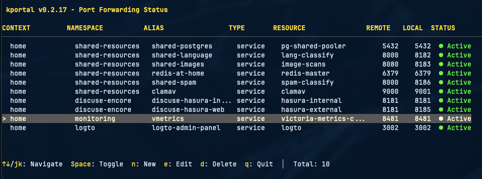

<p align="center">
  
</p>

<p align="center">
  <a href="https://github.com/lukaszraczylo/kportal/releases"></a>
  <a href="LICENSE"></a>
  <a href="https://goreportcard.com/report/github.com/lukaszraczylo/kportal"></a>
</p>

<p align="center">
  <strong>Kubernetes port-forward manager with interactive terminal UI</strong>
</p>

kportal manages multiple Kubernetes port-forwards with an interactive terminal interface. It provides real-time status updates, automatic reconnection, hot-reload configuration, and mDNS hostname publishing.



## ✨ Features

- **Interactive TUI** - Terminal interface with keyboard navigation
- **Live management** - Add, edit, and delete port-forwards without restarting
- **Auto-reconnect** - Exponential backoff retry on connection failures
- **Hot-reload** - Configuration changes applied automatically
- **Health monitoring** - Multiple check methods with stale connection detection
- **Multi-context** - Support for multiple Kubernetes contexts and namespaces
- **Pod restart handling** - Automatic reconnection when pods restart
- **Label selectors** - Dynamic pod targeting using label selectors
- **Port conflict detection** - Validates port availability with PID information
- **mDNS hostnames** - Access forwards via `.local` hostnames
- **HTTP traffic logging** - Real-time HTTP request/response logging for debugging
- **Connection benchmarking** - Built-in HTTP benchmarking with latency statistics
- **Headless mode** - Background operation for scripting and automation

## 🔄 Comparison with Other Tools

| Feature | kportal | [k9s](https://k9scli.io/) | [Kube Forwarder](https://kube-forwarder.pixelpoint.io/) | [kftray](https://kftray.app/) |
|---------|---------|------|----------------|--------|
| **Interface** | Terminal TUI | Terminal TUI | Desktop GUI (Electron) | Desktop GUI + TUI |
| **Persistent Config** | ✅ YAML file | ❌ Session only | ✅ JSON bookmarks | ✅ JSON + Git sync |
| **Auto-reconnect** | ✅ Exponential backoff | ❌ Manual | ✅ Basic | ✅ Watch API |
| **Hot-reload Config** | ✅ File watch + SIGHUP | ❌ | ❌ | ❌ |
| **Health Checks** | ✅ TCP + data-transfer | ❌ | ❌ | ❌ |
| **Stale Connection Detection** | ✅ Age + idle tracking | ❌ | ❌ | ❌ |
| **HTTP Traffic Logging** | ✅ Built-in viewer | ❌ | ❌ | ✅ |
| **Connection Benchmarking** | ✅ Built-in | ✅ Via Hey | ❌ | ❌ |
| **mDNS Hostnames** | ✅ `.local` domains | ❌ | ❌ | ❌ |
| **Label Selectors** | ✅ | ✅ | ❌ | ✅ |
| **Multi-context** | ✅ | ✅ | ✅ | ✅ |
| **Headless Mode** | ✅ | ❌ | ❌ | ❌ |
| **System Tray** | ❌ | ❌ | ❌ | ✅ |
| **UDP Support** | ❌ | ❌ | ❌ | ✅ Proxy relay |
| **Dependencies** | Single binary | Single binary | Electron | Tauri + kubectl |

## 📦 Installation

### Homebrew (macOS)

```bash
brew install --cask lukaszraczylo/taps/kportal
```

> **Note**: If you previously installed via `brew install lukaszraczylo/taps/kportal` (formula), uninstall first:
> ```bash
> brew uninstall kportal
> ```

### Quick Install

```bash
curl -fsSL https://raw.githubusercontent.com/lukaszraczylo/kportal/main/install.sh | bash
```

The installer downloads `kportal-<version>-checksums.txt` from the same release and verifies the archive's SHA-256 before installing. If [`cosign`](https://github.com/sigstore/cosign) is on your `PATH`, the checksums file's keyless cosign signature is also verified against the shared-actions reusable workflow identity.

| Variable | Effect |
|----------|--------|
| `DRY_RUN=1` | Download and verify only; do not install |
| `SKIP_COSIGN=1` | Skip cosign signature verification (SHA-256 is still enforced) |

### Manual Download

Download binaries from the [releases page](https://github.com/lukaszraczylo/kportal/releases).

### Build from Source

```bash
git clone https://github.com/lukaszraczylo/kportal.git
cd kportal
make build && make install
```

### Verifying Release Signatures

All release checksums are signed with [cosign](https://github.com/sigstore/cosign) using keyless signing. To verify:

```bash
# Download the checksum file and its sigstore bundle from the release
cosign verify-blob \
  --certificate-identity-regexp "^https://github\.com/lukaszraczylo/shared-actions/\.github/workflows/go-release\.yaml@refs/heads/main$" \
  --certificate-oidc-issuer "https://token.actions.githubusercontent.com" \
  --bundle "kportal-<version>-checksums.txt.sigstore.json" \
  kportal-<version>-checksums.txt
```

## 🚀 Quick Start

Create `.kportal.yaml`:

```yaml
contexts:
  - name: production
    namespaces:
      - name: backend
        forwards:
          - resource: service/postgres
            protocol: tcp
            port: 5432
            localPort: 5432
            alias: prod-db

          - resource: service/api
            protocol: tcp
            port: 8080
            localPort: 8080
            alias: api
            httpLog: true  # Enable HTTP traffic logging
```

Run:

```bash
kportal
```

### Keyboard Controls

| Key | Action |
|-----|--------|
| `↑↓` / `j/k` | Navigate |
| `Space` / `Enter` | Toggle forward |
| `n` | Add new forward |
| `e` | Edit forward |
| `d` | Delete forward |
| `b` | Benchmark connection |
| `l` | View HTTP logs |
| `q` | Quit |

## 📖 Configuration

### Basic Structure

```yaml
contexts:
  - name: <context-name>
    namespaces:
      - name: <namespace-name>
        forwards:
          - resource: <type>/<name>
            protocol: tcp
            port: <remote-port>
            localPort: <local-port>
            alias: <display-name>      # optional
            selector: <label-selector> # optional
            httpLog: true              # optional - enable HTTP logging
```

### Forward Options

| Field | Required | Description |
|-------|----------|-------------|
| `resource` | Yes | Resource type and name (e.g., `service/postgres`, `pod/my-app`) |
| `protocol` | Yes | Protocol (`tcp`) |
| `port` | Yes | Remote port |
| `localPort` | Yes | Local port |
| `alias` | No | Display name and mDNS hostname |
| `selector` | No | Label selector for pod resolution |
| `httpLog` | No | Enable HTTP traffic logging (`true`/`false`) |

### Resource Formats

| Format | Description |
|--------|-------------|
| `service/name` | Service forwarding |
| `pod/name` | Direct pod by name |
| `pod/prefix` | Pod by prefix (matches `prefix-*`) |
| `pod` + `selector` | Pod by label selector |
| `deployment/name` | Deployment |

### Health Check Configuration

```yaml
healthCheck:
  interval: "3s"           # Check frequency
  timeout: "2s"            # Check timeout
  method: "data-transfer"  # tcp-dial or data-transfer
  maxConnectionAge: "25m"  # Reconnect before k8s timeout
  maxIdleTime: "10m"       # Detect idle connections

reliability:
  tcpKeepalive: "30s"
  dialTimeout: "30s"
  retryOnStale: true
```

Health check methods:
- `tcp-dial` - Fast TCP connection test
- `data-transfer` - Verifies tunnel functionality by attempting data read

Connection age reconnection only triggers when the connection is also idle, preventing interruption of active transfers like database dumps.

### mDNS Hostnames

Enable mDNS to access forwards via `.local` hostnames:

```yaml
mdns:
  enabled: true

contexts:
  - name: production
    namespaces:
      - name: default
        forwards:
          - resource: service/postgres
            port: 5432
            localPort: 5432
            alias: prod-db  # Accessible via prod-db.local:5432
```

- Explicit `alias` becomes `<alias>.local`
- Without alias, hostname is generated from resource name (`service/redis` → `redis.local`)
- Works on macOS (Bonjour) and Linux (avahi-daemon)

Verify registration:
```bash
dns-sd -B _kportal._tcp local       # macOS
avahi-browse -t _kportal._tcp       # Linux
```

## Usage

### Interactive Mode

```bash
kportal
```

### Verbose Mode

```bash
kportal -v
```

### Headless Mode

Run without TUI for scripting and automation:

```bash
kportal -headless
```

Headless mode emits both structured and standard-library logs to stderr by default
(suitable for redirecting to a log file or systemd journal). The `-v` flag controls
log level (debug vs info), not destination.

Combines well with verbose mode for background operation:

```bash
kportal -headless -v 2>kportal.log &
```

### Validate Configuration

```bash
kportal --check
```

### Custom Config File

```bash
kportal -c /path/to/config.yaml
```

### Generate Forwards from a Cluster

The `generate` subcommand discovers services in a Kubernetes context and lets you
interactively pick which ones to forward. Selected entries are appended to the
config file with consecutive local ports starting from a value you choose.

```bash
kportal generate --context=my-cluster
kportal generate --context=my-cluster --config=/path/to/.kportal.yaml
kportal generate --context=my-cluster --dry-run
```

| Flag | Description |
|------|-------------|
| `--context` | (required) Kubernetes context to scan |
| `--config` | Path to kportal config file (default: `.kportal.yaml`) |
| `--dry-run` | Print the planned forwards but do not modify the config |

The interactive flow has three steps:

1. **Namespaces** — multi-select with `space`, toggle-all with `a`, filter with `/`.
2. **Services** — same controls; rows already present in the config are locked off, and non-TCP ports are skipped (UDP is not supported by kportal's forward layer).
3. **Port assignment** — choose a starting local port (default `10000`, must be ≥ `1024`). Local ports are assigned consecutively in stable order, skipping any already in use.

Press `enter` on the final step to save (or to print and exit when `--dry-run` is set), `b` to go back, or `esc` to cancel.

## Status Indicators

| Indicator | Description |
|-----------|-------------|
| `● Active` | Connection healthy |
| `○ Starting` | Initial connection (10s grace period) |
| `◐ Reconnecting` | Reconnecting after failure |
| `✗ Error` | Connection failed |
| `○ Disabled` | Manually disabled |

## Advanced Features

### HTTP Traffic Logging

Press `l` in the TUI to view real-time HTTP traffic for a selected forward. The log viewer shows:

| Column | Description |
|--------|-------------|
| TIME | Request timestamp |
| METHOD | HTTP method (GET, POST, etc.) |
| STATUS | Response status code |
| LATENCY | Request duration |
| PATH | Request path |

**List view shortcuts:**

| Key | Action |
|-----|--------|
| `↑/↓` | Navigate entries |
| `Enter` | View request details |
| `g/G` | Jump to top/bottom |
| `a` | Toggle auto-scroll |
| `f` | Cycle filter mode (All → Non-2xx → Errors) |
| `/` | Search by path or method |
| `c` | Clear all filters |
| `q` | Close log viewer |

**Detail view:**

Press `Enter` on any entry to see full request/response details including:
- Request and response headers (alphabetically sorted)
- Request and response bodies
- Timing information and status codes

| Key | Action |
|-----|--------|
| `↑/↓` | Scroll content |
| `PgUp/PgDn` | Scroll by page |
| `g` | Jump to top |
| `c` | Copy response body to clipboard |
| `Esc/q` | Return to list |

**Body display features:**
- **JSON formatting** - JSON bodies are pretty-printed with syntax highlighting
- **Compression handling** - gzip/deflate content is automatically decompressed
- **Binary detection** - Binary content shows a placeholder instead of garbled data

**Filter modes:**
- **All** - Show all entries
- **Non-2xx** - Hide successful (2xx) responses
- **Errors** - Show only 4xx and 5xx responses

**Toggling per-forward logging:**

In the add/edit wizard, press `h` on the confirmation step to toggle `httpLog` on or
off for the current forward. The wizard preserves any advanced `httpLog` keys
(`logFile`, `includeHeaders`, `maxBodySize`, `filterPath`) you set in YAML.

**Header redaction:**

When `httpLog.includeHeaders: true` is set, sensitive header values are
automatically replaced with `[REDACTED]`. The header name is preserved so you can
see that an `Authorization` header was present without exposing its value. Redacted
headers include `Authorization`, `Cookie`, `Set-Cookie`, `X-Api-Key`,
`X-Auth-Token`, `X-Csrf-Token`, `Proxy-Authorization`, `X-Access-Token`, and any
header whose name contains `token`, `secret`, `password`, or `apikey`. This is
always on and cannot be disabled.

**Advanced configuration:**

```yaml
forwards:
  - resource: service/api
    port: 8080
    localPort: 8080
    httpLog:
      enabled: true
      includeHeaders: true   # values of sensitive headers are redacted
      maxBodySize: 65536     # bytes; 0 = unlimited
      filterPath: "/api/"    # only log paths matching this substring
      logFile: "api.log"     # append entries to a file in addition to the in-memory ring
```

### Connection Benchmarking

Press `b` in the TUI to benchmark a selected forward. Configure:

- **URL Path** - Target endpoint (default: `/`)
- **Method** - HTTP method (GET, POST, etc.)
- **Concurrency** - Number of parallel workers
- **Requests** - Total number of requests

Results include:
- Success/failure counts
- Min/Max/Avg latency
- P50/P95/P99 percentiles
- Throughput (requests/sec)
- Status code distribution

### Hot-Reload

Configuration changes are applied automatically. Manual reload:

```bash
kill -HUP $(pgrep kportal)
```

### Port Conflict Detection

kportal validates port availability at startup and during hot-reload, showing which process is using conflicting ports.

### Retry Strategy

Exponential backoff: 1s → 2s → 4s → 8s → 10s (max). Retries continue indefinitely until connection succeeds.

## Migration from kftray

```bash
kportal --convert configs.json --convert-output .kportal.yaml
```

## Signal Handling

- `Ctrl+C` / `SIGTERM` - Graceful shutdown
- `SIGHUP` - Reload configuration

## 🐛 Troubleshooting

### Port Already in Use

```bash
lsof -i :<port>
kill <pid>
```

### Connection Refused

1. Verify pod is running: `kubectl get pods -n <namespace>`
2. Verify port is correct: `kubectl describe pod <pod>`
3. Check service endpoints: `kubectl get endpoints <service>`

### Context Not Found

```bash
kubectl config get-contexts
```

Context names containing `@`, `.`, `:`, or `/` (e.g. `admin@home`,
`user@cluster.example.com`, GKE dotted names, EKS ARNs) are accepted by the
config validator.

## 🔧 Development

### Prerequisites

- Go 1.23+
- Kubernetes cluster access
- kubectl configured

### Build

```bash
make build    # Build binary
make test     # Run tests
make all      # fmt, vet, staticcheck, test
make install  # Install locally
```

## Contributing

See [CONTRIBUTING.md](CONTRIBUTING.md) for guidelines.

## License

MIT License - see [LICENSE](LICENSE).

## Acknowledgments

- [Bubble Tea](https://github.com/charmbracelet/bubbletea) - Terminal UI framework
- [Lipgloss](https://github.com/charmbracelet/lipgloss) - Terminal styling
- [client-go](https://github.com/kubernetes/client-go) - Kubernetes client
- [kftray](https://github.com/hcavarsan/kftray) - Inspiration

## Links

- [Website](https://lukaszraczylo.github.io/kportal)
- [Issues](https://github.com/lukaszraczylo/kportal/issues)
- [Releases](https://github.com/lukaszraczylo/kportal/releases)
- [Changelog](CHANGELOG.md)
