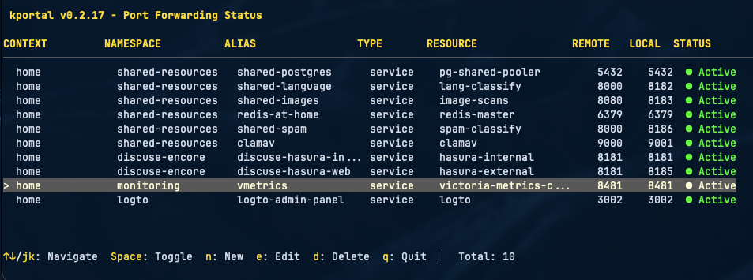

<p align="center">
  
</p>

<p align="center">
  <a href="https://github.com/lukaszraczylo/kportal/releases"></a>
  <a href="LICENSE"></a>
  <a href="https://goreportcard.com/report/github.com/lukaszraczylo/kportal"></a>
</p>

# kportal

kportal runs many Kubernetes port-forwards from one YAML file and shows their status in a terminal UI. It reconnects dropped forwards, reloads the file when it changes, and can run without the UI.



Screenshot from kportal v0.2.17. The current key bar also lists `PgUp`/`PgDn`, `b` (Bench) and `l` (Logs).

Website: <https://lukaszraczylo.github.io/kportal>

## Contents

- [Features](#features)
- [Comparison](#comparison-with-other-tools)
- [Installation](#installation)
- [Quick start](#quick-start)
- [Configuration](#configuration)
- [Usage](#usage)
- [Status indicators](#status-indicators)
- [Advanced features](#advanced-features)
- [Migration from kftray](#migration-from-kftray)
- [Signal handling](#signal-handling)
- [Troubleshooting](#troubleshooting)
- [Development](#development)
- [Telemetry](#telemetry)
- [License](#license)

## Features

| Area | What kportal does |
|------|-------------------|
| Forwards | Forwards to `service/<name>`, `pod/<name>` (exact name or name prefix), or `pod` with a label `selector`. Only TCP is supported. |
| Terminal UI | Add (`n`), edit (`e`), delete (`d`) and toggle (`Space`) forwards without a restart. The add wizard writes the config file. |
| Table columns | `tui.columns` sets which columns the forwards table shows, their order and their width. It applies to the UI and to the `-v` table. |
| Add wizard | If the cluster does not allow listing namespaces, the wizard asks you to type the namespace. |
| Reconnect | Retries with exponential backoff: 1s, 2s, 4s, 8s, then 10s, with 10% jitter. It does not stop retrying. |
| Pod restarts | Forwards by pod prefix or selector connect to a new pod after a restart. |
| Health checks | `tcp-dial` or `data-transfer` check every 3s by default. A connection is stale when it is older than `maxConnectionAge` and idle, or idle longer than `maxIdleTime`. |
| Hot reload | The file watcher and `SIGHUP` reload the config. An invalid config is rejected and the previous one stays active. |
| Contexts | Several Kubernetes contexts and namespaces in one file. `--context` selects which contexts run. |
| Port conflicts | Startup and reload checks report a busy local port and the process that holds it. |
| mDNS | With `mdns.enabled: true`, each forward is reachable as `<alias>.local`. Without an alias, the resource name is used. |
| HTTP log | Per-forward request and response log in the UI, with detail view, filter, search, JSON formatting, gzip/deflate decoding and clipboard copy. |
| Header redaction | With `includeHeaders: true`, values of sensitive headers such as `Authorization` and `Cookie` become `[REDACTED]`. You cannot turn this off. |
| Benchmark | Press `b` to send HTTP requests through a forward. Reports success and failure counts, min/max/avg latency, P50/P95/P99, requests per second and status codes. |
| Generate | `kportal generate` lists services in a cluster and appends the ones you pick to the config with consecutive local ports. |
| Headless | `-headless` runs without the UI and logs to stderr. `-log-format json` switches the log format. |
| Import | `-convert` turns a kftray JSON file into a kportal YAML file. |
| Shell completion | `kportal completion` prints a bash, zsh or fish completion script, or installs it. |
| Verified installer | `install.sh` checks the archive SHA-256 and, if `cosign` is on `PATH`, the keyless signature of the checksums file. |
| Updates | `-update` checks for a newer release. `-version` prints the version. |

## Comparison with other tools

Compared on 2026-10-02 against each project's README and docs. Check their repositories for changes. The kportal column comes from this repository's code. "Not documented" means the project's README and docs do not say.

| Feature | kportal | kubectl port-forward | k9s | kubefwd | kftray |
|---------|---------|----------------------|-----|---------|--------|
| Many forwards in one config file | Yes | No | Partial (annotations configure forwards; no forward list file) | Partial (`example.fwdconf.yml` exists) | Yes |
| Automatic reconnect | Yes | Not documented | Not documented | Yes | Yes |
| Follows pod restarts by label or name prefix | Yes | Not documented | Not documented | Yes (label filter) | Yes |
| Terminal UI of all forwards | Yes | No | Yes (PortForward view, alias `pf`; forwards last for the session) | Yes | Yes |
| GUI | No | No | No | No | Yes |
| Config hot reload | Yes (file watcher, `SIGHUP`) | No | Partial (`benchmarks.yaml` only) | Not documented | Not documented |
| HTTP request and response logging | Yes | No | Not documented | Not documented | Yes |
| Health checks | Yes (`tcp-dial`, `data-transfer`) | Not documented | Not documented | Not documented | Partial (README says it tracks pod health) |
| mDNS or friendly hostnames | Yes (mDNS) | No | No | Partial (edits `/etc/hosts`, not mDNS; needs root) | Not documented |
| Built-in benchmark | Yes | No | Yes (`hey`, key `b`) | Not documented | Not documented |
| Imports another tool's config | Yes (kftray JSON) | No | No | Not documented | Partial (JSON, GitHub repos, service annotations; not other tools' formats) |
| Several contexts in one config | Yes | No | Partial | Partial | Not documented |
| Local port conflict detection | Yes (reports the holding process) | Partial (`:remotePort` picks a free port) | Not documented | Yes | Not documented |
| Platforms | Linux, macOS, Windows | Not documented | macOS, Linux, Windows | macOS, Linux, Windows | macOS, Linux, Windows |
| Licence | MIT | Not documented | Apache-2.0 | Apache-2.0 | GPL-3.0 |
| Language | Go | Not documented | Go | Go | Rust (Tauri, Ratatui) |
| Latest release (2026-10-02) | [Releases](https://github.com/lukaszraczylo/kportal/releases) | Not documented | v0.51.0 (2026-06-06) | v1.25.16 (2026-06-20) | v0.29.2 (2026-09-29) |

When another tool fits better:

- kubectl port-forward for a one-off forward. It needs no config file and ships with kubectl.
- k9s for general cluster browsing and its built-in benchmark.
- kubefwd to forward every service in a namespace with local DNS names.
- kftray for a tray GUI, shared JSON configs and UDP.

Kube Forwarder is a GUI-only forwarder. Its last release was 2019-08-14.

Sources:

- kubectl: [Use Port Forwarding to Access Applications in a Cluster](https://kubernetes.io/docs/tasks/access-application-cluster/port-forward-access-application-cluster/)
- k9s: <https://github.com/derailed/k9s> and <https://k9scli.io/topics/bench/>
- kubefwd: <https://github.com/txn2/kubefwd>
- kftray: <https://github.com/hcavarsan/kftray>

## Installation

### Homebrew (macOS)

```bash
brew install --cask lukaszraczylo/taps/kportal
```

If you installed the formula (`brew install lukaszraczylo/taps/kportal`) earlier, run `brew uninstall kportal` first.

### Quick install

```bash
curl -fsSL https://raw.githubusercontent.com/lukaszraczylo/kportal/main/install.sh | bash
```

The script downloads `kportal-<version>-checksums.txt` from the same release and verifies the archive SHA-256. If [`cosign`](https://github.com/sigstore/cosign) is on `PATH`, it also verifies the keyless signature of the checksums file.

| Variable | Effect |
|----------|--------|
| `DRY_RUN=1` | Download and verify only. Do not install. |
| `SKIP_COSIGN=1` | Skip the cosign check. The SHA-256 check still runs. |
| `INSTALL_DIR` | Target directory. Default `/usr/local/bin`. |
| `KPORTAL_VERSION` | Install a specific version, for example `1.2.3`, instead of the latest. |
| `COSIGN_CERT_IDENTITY_REGEXP` | Certificate identity to accept. Set it if you fork the release pipeline. |

Example:

```bash
curl -fsSL https://raw.githubusercontent.com/lukaszraczylo/kportal/main/install.sh | DRY_RUN=1 bash
```

### Manual download

The [releases page](https://github.com/lukaszraczylo/kportal/releases) has archives for Linux, macOS and Windows on amd64 and arm64. Archives are named `kportal-<version>-<os>-<arch>.tar.gz`, and `.zip` on Windows. Each release also has a `kportal-<version>-checksums.txt` file.

### Build from source

Go 1.26 or later is required (see `go.mod`).

```bash
git clone https://github.com/lukaszraczylo/kportal.git
cd kportal
make build && make install
```

`make install` copies the binary to `/opt/homebrew/bin` if that directory exists, otherwise to `~/.local/bin` on macOS and Linux.

### Verifying release signatures

Release checksums are signed with [cosign](https://github.com/sigstore/cosign) using keyless signing. Download the checksums file and its sigstore bundle from the release, then run:

```bash
cosign verify-blob \
  --certificate-identity-regexp "^https://github\.com/lukaszraczylo/shared-actions/\.github/workflows/go-release\.yaml@refs/heads/main$" \
  --certificate-oidc-issuer "https://token.actions.githubusercontent.com" \
  --bundle "kportal-<version>-checksums.txt.sigstore.json" \
  kportal-<version>-checksums.txt
```

Replace `<version>` with the release version, for example `1.2.3`. Then check the archive against the verified checksums file with `shasum -a 256` or `sha256sum`.

## Quick start

Create `.kportal.yaml`:

```yaml
contexts:
  - name: production
    namespaces:
      - name: backend
        forwards:
          - resource: service/postgres
            protocol: tcp
            port: 5432
            localPort: 5432
            alias: prod-db

          - resource: service/api
            protocol: tcp
            port: 8080
            localPort: 8080
            alias: api
            httpLog: true
```

Each `name` under `contexts` must exist in your kubeconfig. List them with `kubectl config get-contexts`.

Run:

```bash
kportal
```

### Keyboard controls

Forwards list:

| Key | Action |
|-----|--------|
| `Up` `Down` / `j` `k` | Move the selection |
| `PgUp` `PgDn` / `Ctrl+u` `Ctrl+d` | Move by 10 rows |
| `Space` / `Enter` | Toggle the forward |
| `n` | Add a forward |
| `e` | Edit the forward |
| `d` | Delete the forward (asks to confirm) |
| `b` | Benchmark the forward |
| `l` | Open the HTTP log |
| `q` / `Ctrl+c` | Quit |

In the add and edit wizard, `h` on the confirmation step toggles `httpLog`. Advanced `httpLog` keys you set in YAML stay unchanged.

HTTP log keys are listed under [HTTP traffic logging](#http-traffic-logging).

## Configuration

### Basic structure

```yaml
contexts:
  - name: <context-name>
    namespaces:
      - name: <namespace-name>
        forwards:
          - resource: <type>/<name>
            protocol: tcp
            port: <remote-port>
            localPort: <local-port>
            alias: <display-name>      # optional
            selector: <label-selector> # optional
            httpLog: true              # optional
```

### Forward options

| Field | Required | Description |
|-------|----------|-------------|
| `resource` | Yes | `service/<name>`, `pod/<name>`, or `pod` with `selector` |
| `protocol` | No | `tcp`. No other value is accepted. |
| `port` | Yes | Remote port |
| `localPort` | Yes | Local port |
| `alias` | No | Display name and mDNS hostname |
| `selector` | With bare `pod` | Label selector. Not allowed with `pod/<name>`. |
| `httpLog` | No | `true`, or a map of options (see [HTTP traffic logging](#http-traffic-logging)) |

### Resource formats

| Format | Description |
|--------|-------------|
| `service/name` | Forward to a service |
| `pod/name` | Forward to a pod by exact name, or by name prefix |
| `pod` with `selector` | Forward to a pod picked by label selector |

Valid resource types are `pod` and `service`. To reach a deployment, use `pod` with a `selector`.

### Health checks and reliability

```yaml
healthCheck:
  interval: "3s"
  timeout: "2s"
  method: "data-transfer"  # or tcp-dial
  maxConnectionAge: "25m"
  maxIdleTime: "10m"

reliability:
  tcpKeepalive: "30s"
  dialTimeout: "30s"
  retryOnStale: true
  watchdogPeriod: "30s"
```

The values above are the defaults from `.kportal.yaml`.

- `tcp-dial` opens a TCP connection to the local port.
- `data-transfer` also tries to read data through the tunnel. It is the default.
- A connection past `maxConnectionAge` reconnects only when it is also idle, so a running transfer is not cut.
- `watchdogPeriod` is the interval of the check for hung workers.

### mDNS

```yaml
mdns:
  enabled: true

contexts:
  - name: production
    namespaces:
      - name: default
        forwards:
          - resource: service/postgres
            port: 5432
            localPort: 5432
            alias: prod-db   # reachable as prod-db.local:5432
```

- `alias: prod-db` publishes `prod-db.local`.
- Without an alias, `service/redis` publishes `redis.local`.
- A bare `pod` with a selector and no alias is not published.
- Services register as `_kportal._tcp`.

Check registration:

```bash
dns-sd -B _kportal._tcp local       # macOS
avahi-browse -t _kportal._tcp       # Linux
```

### Table columns

```yaml
tui:
  columns:
    - name: alias
      width: 30      # optional, 1-200
    - name: resource
    - name: local
    - name: status
```

- Valid names: `context`, `namespace`, `alias`, `type`, `resource`, `remote`, `local`, `status`.
- List order is render order. Unlisted columns are hidden.
- `width` is the maximum text width, 1 to 200. Without it, the column keeps its default width.
- Without `tui`, the table keeps its default columns and order.
- The setting applies to the UI and to the `-v` table, and reloads with the file.

## Usage

### Command line

| Command or flag | Effect |
|-----------------|--------|
| `kportal` | Start the terminal UI. |
| `-c <file>` | Config file. Default `.kportal.yaml`. |
| `-v` | Verbose logging. In headless mode it sets the log level only. |
| `-headless` | No UI. Logs go to stderr. |
| `-check` | Validate the config and exit. |
| `-context <name>` | Forward only the named contexts. Repeatable and comma-separated. |
| `-log-format text\|json` | Log format. Default `text`. |
| `-convert <file>` | Convert a kftray JSON file to kportal YAML. |
| `-convert-output <file>` | Output of `-convert`. Default `.kportal.yaml`. |
| `-update` | Check for updates and exit. |
| `-version` | Print the version and exit. |
| `kportal generate` | Add forwards from a cluster. |
| `kportal completion` | Print or install a shell completion script. |

Each flag also accepts the double-dash form, for example `--check`.

### Interactive mode

```bash
kportal
```

### Verbose mode

```bash
kportal -v
```

Without `-headless`, `-v` prints a plain-text table that redraws. The table uses the same status words as the UI. When stdout is not a terminal, it draws `✓ Active`, `⋯ Starting`, `↻ Reconnecting` and `✗ Error`.

### Headless mode

```bash
kportal -headless
kportal -headless -v 2>kportal.log &
kportal -headless -log-format json
```

Headless mode logs to stderr, so you can redirect it to a file or the systemd journal. `-v` sets the log level, not the destination.

### Validate configuration

```bash
kportal -check
```

### Custom config file

```bash
kportal -c /path/to/config.yaml
```

### Select contexts

By default kportal forwards every context in the file. `--context` limits the run to the contexts you name:

```bash
kportal --context development-team-a
kportal --context team-a --context team-b
kportal --context team-a,team-b
```

An unknown name is an error that lists the contexts in the file. Those are the `contexts[].name` values in `.kportal.yaml`, not every context in your kubeconfig.

Local-port conflicts are only reported between forwards that can run together. With `--context`, contexts you never select together can reuse a `localPort`:

```yaml
contexts:
  - name: development-team-a
    namespaces:
      - name: rate-service
        forwards:
          - &rate-service
            resource: pod/rpc-server
            protocol: tcp
            port: 50051
            localPort: 3004
            alias: rate-service

  - name: development-team-b
    namespaces:
      - name: rate-service
        forwards:
          - <<: *rate-service   # same local port, no conflict
```

Without `--context`, or with both contexts named, the duplicate port is an error.

### Generate

```bash
kportal generate --context=my-cluster
kportal generate --context=my-cluster --config=/path/to/.kportal.yaml
kportal generate --context=my-cluster --dry-run
```

| Flag | Description |
|------|-------------|
| `--context` | Required. Kubernetes context to scan. |
| `--config` | Config file to append to. Default `.kportal.yaml`. |
| `--dry-run` | Print the planned forwards. Do not change the config. |

Steps:

1. Namespaces: select with `space`, toggle all with `a`, filter with `/`.
2. Services: same keys. Services already in the config are locked. Non-TCP ports are skipped.
3. Port assignment: choose a first local port (default `10000`, minimum `1024`). Ports are assigned in order and skip ports in use.

Press `enter` on the last step to save (or print, with `--dry-run`), `b` to go back, `esc` to cancel.

The `--dry-run` output has this form (example values):

```text
[dry-run] Would add 2 forwards to .kportal.yaml
  10000 → my-cluster/default/service/api:8080
  10001 → my-cluster/default/service/postgres:5432
```

### Shell completion

```bash
kportal completion --shell zsh            # print the script
kportal completion --shell zsh --install  # install it
kportal completion --uninstall            # remove it
```

Without `--shell`, kportal detects the shell. Supported shells: bash, zsh, fish.

## Status indicators

| Indicator | Meaning |
|-----------|---------|
| `● Active` | Connection healthy |
| `○ Starting` | First connection. Failed health checks show Starting for the first 10s. |
| `◐ Reconnecting` | Reconnecting after a failure |
| `✗ Error` | Connection failed |
| `○ Disabled` | Turned off in the UI |

## Advanced features

### HTTP traffic logging

Press `l` on a forward that has `httpLog` set.

```yaml
forwards:
  - resource: service/api
    port: 8080
    localPort: 8080
    httpLog:
      enabled: true
      includeHeaders: true   # sensitive values are redacted
      maxBodySize: 65536     # bytes
      filterPath: "/api/"    # log only paths containing this text
      logFile: "api.log"     # also append entries to this file
```

`maxBodySize` defaults to 1 MB (1048576 bytes) when you omit it or set a value of 0 or less.

List view columns: TIME, METHOD, STATUS, LATENCY, PATH.

| Key | Action |
|-----|--------|
| `Up` `Down` | Move |
| `Enter` | Open details |
| `g` / `G` | Top / bottom |
| `a` | Toggle auto-scroll |
| `f` | Cycle filter: All, Non-2xx, Errors |
| `/` | Search path or method |
| `c` | Clear filters |
| `q` | Close |

The detail view shows sorted request and response headers, bodies and timing. JSON bodies are pretty-printed, gzip and deflate bodies are decoded, and binary bodies show a placeholder.

| Key | Action |
|-----|--------|
| `Up` `Down` / `PgUp` `PgDn` | Scroll |
| `g` | Top |
| `c` | Copy the response body |
| `Esc` / `q` / `Enter` | Back to the list |

#### Sensitive header redaction

With `includeHeaders: true`, kportal replaces these header values with `[REDACTED]` and keeps the name: `Authorization`, `Cookie`, `Set-Cookie`, `X-Api-Key`, `X-Auth-Token`, `X-Csrf-Token`, `Proxy-Authorization`, `X-Access-Token`, and any name containing `token`, `secret`, `password` or `apikey` (any case). You cannot turn this off. Source: `internal/httplog/proxy.go`.

### Benchmarking

Press `b` on a forward. Set the URL path (default `/`), the HTTP method, the concurrency and the request count. The wizard starts at 10 workers and 100 requests.

The results screen has this layout (`x.xx` marks a measured value):

```text
Total Requests:  100
Successful:      100 (100.0%)
Failed:          0

Latency (ms)
  Min:    x.xx
  Max:    x.xx
  Avg:    x.xx
  P50:    x.xx
  P95:    x.xx
  P99:    x.xx

Throughput
  Requests/sec:  x.xx
  Bytes read:    n

Status Codes
  200: n
```

Only 2xx responses count as successful.

### Hot reload

kportal reloads when the config file changes. To reload by hand:

```bash
kill -HUP $(pgrep kportal)
```

New forwards start, removed forwards stop and unchanged forwards keep running. An invalid config is rejected and the previous one stays active.

### Port conflict detection

kportal checks that local ports are free at startup and on reload. The report names the process that holds a busy port. kportal finds it with `lsof` on Linux and macOS and `tasklist` on Windows. A reload that would bind a busy port is rejected and the previous config stays active.

Conflicts are only reported between forwards that can run together. See [Select contexts](#select-contexts).

### Retry strategy

Exponential backoff with 10% jitter: 1s, 2s, 4s, 8s, then 10s (cap). Retries continue until the connection succeeds.

## Migration from kftray

```bash
kportal --convert configs.json --convert-output .kportal.yaml
```

`-convert-output` defaults to `.kportal.yaml`.

## Signal handling

| Signal | Effect |
|--------|--------|
| `Ctrl+C`, `SIGTERM` | Graceful shutdown |
| `SIGHUP` | Reload the configuration |

## Troubleshooting

Port already in use:

```bash
lsof -i :<port>
kill <pid>
```

Connection refused:

1. Check the pod: `kubectl get pods -n <namespace>`
2. Check the port: `kubectl describe pod <pod>`
3. Check the service endpoints: `kubectl get endpoints <service>`

Context not found: list your contexts with `kubectl config get-contexts`. kportal reports `context <name> not found in kubeconfig` when a `contexts[].name` value is not in your kubeconfig. Names with `@`, `.`, `:` or `/` (for example `admin@home` or an EKS ARN) are valid. If `--context` reports `unknown context`, the name is missing from `contexts[].name` in the config file.

The add wizard shows a namespace prompt instead of a list: the cluster refused or returned an empty namespace list. Type the namespace name.

## Development

Requires Go 1.26 or later, kubectl and access to a cluster.

```bash
make build    # build the binary
make test     # run tests
make all      # fmt, vet, staticcheck, test
make install  # install locally
```

See [CONTRIBUTING.md](CONTRIBUTING.md) for guidelines. Release history is in [CHANGELOG.md](CHANGELOG.md).

## Telemetry

On startup kportal sends one anonymous adoption ping: project name, version and timestamp. It has a 2-second timeout and cannot block startup.

To opt out, set `DO_NOT_TRACK=1`, `OSS_TELEMETRY_DISABLED=1` or `KPORTAL_DISABLE_TELEMETRY=1`. See [oss-telemetry](https://github.com/lukaszraczylo/oss-telemetry#disabling-telemetry) for the wire format and source.

## License

MIT. See [LICENSE](LICENSE).

## Credits

[Bubble Tea](https://github.com/charmbracelet/bubbletea), [Lipgloss](https://github.com/charmbracelet/lipgloss), [client-go](https://github.com/kubernetes/client-go). [kftray](https://github.com/hcavarsan/kftray) was the inspiration.

## Links

- [Website](https://lukaszraczylo.github.io/kportal)
- [Issues](https://github.com/lukaszraczylo/kportal/issues)
- [Releases](https://github.com/lukaszraczylo/kportal/releases)
